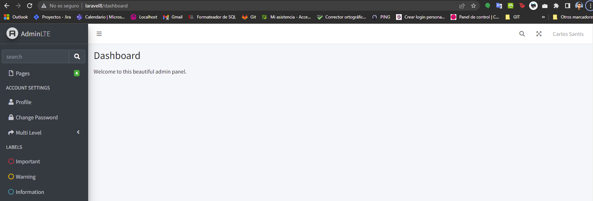

# Proyecto Laravel 8 con plantilla AdminLte V3

## Versiones

- [Laravel 8 con plantilla AdminLte V3](README.md)
- [Laravel 9 con plantilla AdminLte V3](README_laravel9.md)

## Control de cambios:

- 02-02-2023:
  - ajuste de comandos de instalacion de plantilla
  - listado/instalación plugins adminlte
- 14-06-2023:
  - Proyecto Laravel 9 con plantilla AdminLte V3
  - [Guía Laravel 9](README_laravel9.md)
  - Eliminación de Laravel Breeze

## Requisitos Previos:

- Instalar composer de forma global [Link](https://getcomposer.org/)
- Instalar Git [Link](https://git-scm.com/downloads)
- Instalar un entorno de desarrollo (Php8, Mysql/SQL, Apache), ejemplo: WampServer [Link](https://www.wampserver.com/en/).

---

Guía de instalación y configuración mediante comandos

- Instalación Laravel 8

```sh
 composer create-project --prefer-dist laravel/laravel:^8.0 laravel8
 cd laravel8
 composer install
 cp .env.example .env
 php artisan key:generate
 php artisan storage:link
```

Si aún no has configurado la base de datos, puedes migrar el modelo inicial de Laravel con el siguiente comando:

```sh
php artisan migrate
```

> Importante! Recuerde que antes de ejecutar nuestra migración debe establecer el largo de caracteres que tendrá por defecto las columnas a migrar, esto se establece en el archivo: app\Providers\AppServiceProvider.php, agregando el siguiente código en la función "boot": "Schema::defaultStringLength(191);".

- Instalación de herramienta de depuración "Laravel Debugbar":
  > Antes de continuar con nuestra migración, se recomienda instalar la librería de "Laravel Debugbar", el cual permite trazar de forma óptima la performance del servicio además de encontrar con varios métodos de depuración de código, para mas información puede visitar el repositorio público de GitHub: [laravel-debugbar](https://github.com/barryvdh/laravel-debugbar)

```sh
composer require barryvdh/laravel-debugbar --dev
php artisan vendor:publish --provider="Barryvdh\Debugbar\ServiceProvider"
```

- Publicación de archivos de errores:

```sh
php artisan vendor:publish --tag=laravel-error
```

- Librería Laravel Español:

```sh
composer require laraveles/spanish
php artisan vendor:publish --tag=lang
php artisan laraveles:install-lang
```

- Instalación AdminLte

```sh
composer require jeroennoten/laravel-adminlte
php artisan adminlte:install
```

- Para visualizar los paquetes instalados de AdminLte puede ejecutar el siguiente comando:

```sh
php artisan adminlte:status
```

- Instalación de vistas de autentificación AdminLte:

```sh
composer require laravel/ui
php artisan ui bootstrap --auth
php artisan adminlte:install --only=auth_views
php artisan adminlte:install --only=main_views
npm install && npm run dev
```

- Una vez instalada la librería por completo podemos comenzar a utilizar las plantillas predefinidas, para esto podemos apoyarnos en la siguiente documentación: [Laravel-AdminLTE](https://github.com/jeroennoten/Laravel-AdminLTE/wiki/Usage)
- Ejemplo: archivo "laravel8\resources\views\dashboard.blade.php" reemplazar su contenido por el siguiente código:

```php
@extends('adminlte::page')

@section('title', 'Dashboard')

@section('content_header')
        <h1>Dashboard</h1>
@stop

@section('content')
        <p>Welcome to this beautiful admin panel.</p>
@stop

@section('css')
        <link rel="stylesheet" href="/css/admin_custom.css">
@stop

@section('js')
        <script> console.log('Hi!'); </script>
@stop
```

- 

---

Instalación de plugins adicionales internos de adminlte

> AdminLte v3 incluye una lista de paquetes asociados a librerias mas recurrentes con las cuales se integra de forma habitual.
> Para tener la lista de los plugins disponibles puede ejecutar el siguiente comando:

```sh
php artisan adminlte:plugins
```

> Para instalar algunos de estos plugins puede ejecutar el siguiente comando indicando el "Key" del plugin:

```sh
php artisan adminlte:plugins install --plugin=icheckBootstrap
php artisan adminlte:plugins install --plugin=paceProgress
```

---

## Comandos generales de ayuda:

```sh
composer update
php artisan storage:link
npm install
npm run dev
php artisan route:cache
php artisan view:cache
php artisan config:clear
php artisan optimize
```

---

## Comandos de instalación asociados a proyecto actual:

```sh
git clone https://github.com/csantisgallegos/laravel8_adminltev3.git
cd laravel8_adminltev3/laravel8
cp .env.example .env (debe establecer variables de conexion a base de datos)
composer update
npm install && npm run dev
php artisan key:generate
php artisan storage:link
php artisan route:cache && php artisan view:cache && php artisan config:clear && php artisan optimize
```

---

Bibliografía:

- [Git - la guía sencilla](http://rogerdudler.github.io/git-guide/index.es.html)
- [Laravel 8](https://laravel.com/docs/8.x)
- [Laravel-AdminLTE](https://github.com/jeroennoten/Laravel-AdminLTE)
